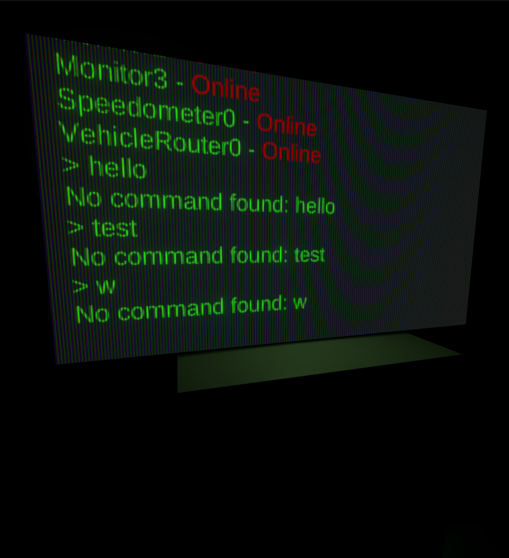
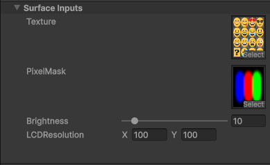
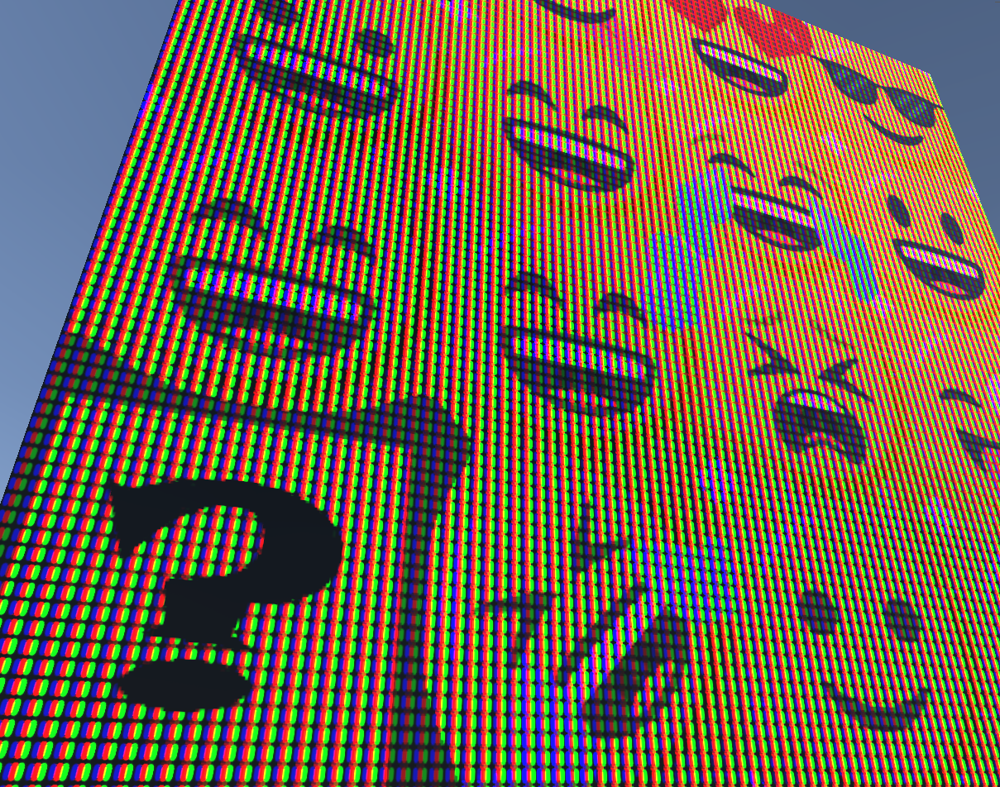

# Screen Shaders

## LCD Shader

LCD shader mimics the look of a screen by masking the input using tiled RGB pixels.

---

The shader supports RenderTextures as input.

The output is sent to the materials emission channel.

The resolution of the pixel tiling is customizable.

Brightness is also adjustable.

---

### Example Videos

[Dingus OS - Remote camera test](https://youtu.be/MuDivyC8LFg)

[Satellite Orbit](https://youtu.be/FrbAJCYsdIY)